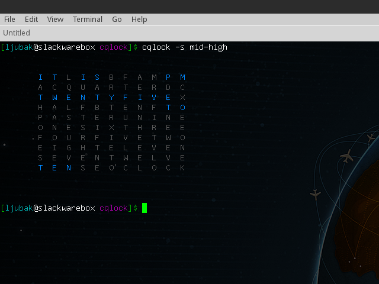
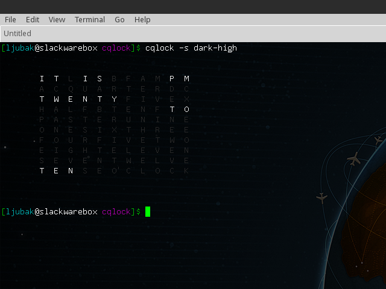
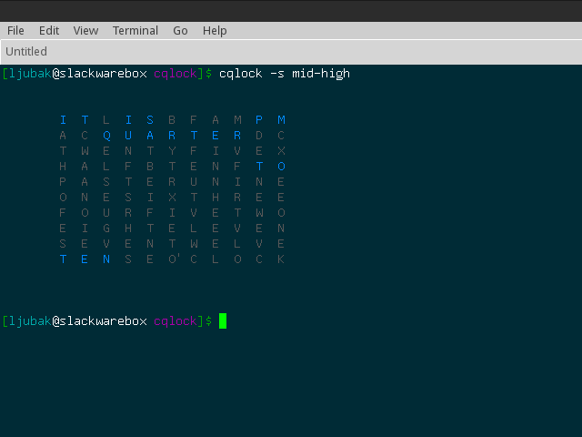
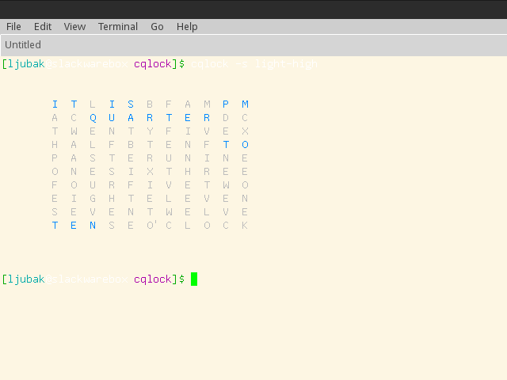

cqlock
======
Terminal application that displays current time in the qlocktwo fashion.
It is C implementation of script written for conky
(http://pastebin.com/wK7JmG9H) with some improvements :-). It currently supports
three color schemes for displaying data. Color schemes were inspired by
[Solarized](http://ethanschoonover.com/solarized) color scheme.


Screenshots
===========
Xfce terminal emulator, color scheme: mid-high.





Xfce terminal emulator, color scheme: dark-high.




Xfce terminal emulator, color scheme: mid-high with background color set to
\#002b36.




Xfce terminal emulator, color scheme: mid-high with background color set to
\#fdf6e3.


Installation
============
Compile with:
```bash
$ RELEASE=true make cqlock
```

install with (as root):
```bash
$ strip --strip-unneeded ./cqlock
$ install -m 755 ./cqlock /usr/bin/
```
